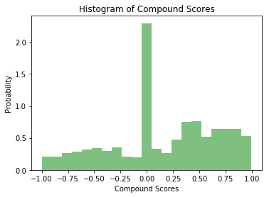
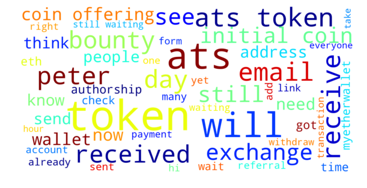

# VADER Sentiment Analysis of Bitcointalk Topics
***Ronald DeLuca***<br>

python3 -m spacy download en_core_web_sm


```python
import csv
import nltk
import os
import pandas as pd
import re
import spacy
import textblob
from textblob import TextBlob
from textblob.base import BaseSentimentAnalyzer
from textblob.sentiments import NaiveBayesAnalyzer, PatternAnalyzer
from textblob.classifiers import NaiveBayesClassifier
from operator import methodcaller
from operator import attrgetter
from spacy.tokens import Doc
from collections import Counter
from vaderSentiment.vaderSentiment import SentimentIntensityAnalyzer
from wordcloud import WordCloud, STOPWORDS
from matplotlib import pyplot as plt
pd.options.display.max_colwidth = 500
```

### Input CSV Name Here


```python
#csvName = 'ATS_20190925-235549'   # Change this string value to the file you want
csvName = 'GTC_20190925-021514'
#csvName = 'PGT_20190923-153422'
#csvName = 'TICS_20190925-045521'
# The inputCsvName represents a .csv file located in the data/raw_data/*.csv folder
inputCsvName = 'data/raw_data/' + csvName + '.csv'  # Change the relative or absolute path here
```


```python
Analyzer = SentimentIntensityAnalyzer()
# Custom Cryptocurrency word sentiment values
new_words = {
    'hold': 0.5,
    'lambo': 1.5,
    'moon': 1.5,
    'mooning': 1.6,
    'bull': 1,
    'bear': -0.5,
    'shill': -1,
    'shilling': -1.5,
    'pump': -0.75,
    'decentralized': 0.5,
    'noob': -0.5,
    'whale': 0.5,
    '51%': -1,
    'denial': -1.4,
    'fundamental': 0.1,
    'analysis': 0.3,
    'oracle': 0.25,
    'shitcoin': -3,
    'volatile': -0.75,
}
# Update the VADER lexicon with these additional sentiment values
Analyzer.lexicon.update(new_words)

# Rate the post content and categorize it based on compound score
def vader_polarity(text):
    """ Transform the output to a binary 0/1 result """
    score = Analyzer.polarity_scores(text)
    total_positive_score = score['pos']
    total_negative_score = score['neg']
    total_neutral_score = score['neu']
    compound_score = score['compound']
    
    if (total_neutral_score > 1 and total_positive_score > total_negative_score and total_positive_score >= total_neutral_score):
        sentiment = 'Positive'
    elif (total_neutral_score > 1 and total_negative_score > total_positive_score and total_negative_score >= total_neutral_score):
        sentiment = 'Negative'
    elif (total_neutral_score > 1 and total_neutral_score > total_positive_score and total_neutral_score > total_negative_score):
        sentiment = 'Neutral'
    elif (total_neutral_score > 1 and total_negative_score == total_positive_score and total_negative_score >= total_neutral_score):
        sentiment = 'Neutral'
    elif (total_neutral_score <= 1 and total_positive_score == total_negative_score and total_positive_score == total_neutral_score):
        sentiment = "Neutral"
    elif (total_neutral_score <= 1 and total_positive_score > total_negative_score):
        sentiment = "Positive"
    elif (total_neutral_score <= 1 and total_negative_score > total_positive_score):
        sentiment = "Negative"
    else:
        if score['compound'] >= 0.5:
            sentiment = 'Positive'
        elif score['compound'] > -0.5 and score['compound'] < 0.5:
            sentiment = 'Neutral'
        elif score['compound'] <= -0.5:
            sentiment = 'Negative'
    return sentiment

# A helper function that removes all the non ASCII characters
# from the given string. Retuns a string with only ASCII characters.
def strip_non_ascii(string):
    ''' Returns the string without non ASCII characters'''
    stripped = (c for c in string if 0 < ord(c) < 127)
    return ''.join(stripped)
```


```python
posts = []
# Open the CSV 
with open(inputCsvName, 'r') as csvfile:
        reader = csv.reader((x.replace('\0', '') for x in csvfile), delimiter=',')
        #reader.next()
        for row in reader:
            # Assign columns to usable names
            post= dict()
            post['id'] = row[0]
            post['msg_id'] = row[1]
            post['parent_id'] = row[2]
            post['link_id'] = row[3]
            post['Count_read'] = row[4]
            post['Forum'] = row[5]
            post['Time'] = row[6]
            post['Author'] = row[7]
            post['Rank'] = row[8]
            post['Activity'] = row[9]
            post['Merit'] = row[10]
            post['Trust'] = row[11]
            post['Title'] = row[12]
            post['Body'] = row[13]
            post['ScamHeader'] = row[14]

            post['clean'] = post['Body']

            # Remove all non-ascii characters
            post['clean'] = strip_non_ascii(post['clean'])

            # Normalize case
            post['clean'] = post['clean'].lower()

            # Remove URLS.
            post['clean'] = re.sub(r'http[s]?://(?:[a-zA-Z]|[0-9]|[$-_@.&+]|[!*\(\),]|(?:%[0-9a-fA-F][0-9a-fA-F]))+', '', post['clean'])
            post['clean'] = re.sub(r'stratum[+]tcp?://(?:[a-zA-Z]|[0-9]|[$-_@.&+]|[!*\(\),]|(?:%[0-9a-fA-F][0-9a-fA-F]))+', '', post['clean'])

            # Fix classic post lingo
            post['clean'] = re.sub(r'\bthats\b', 'that is', post['clean'])
            post['clean'] = re.sub(r'\bive\b', 'i have', post['clean'])
            post['clean'] = re.sub(r'\bim\b', 'i am', post['clean'])
            post['clean'] = re.sub(r'\bya\b', 'yeah', post['clean'])
            post['clean'] = re.sub(r'\bcant\b', 'can not', post['clean'])
            post['clean'] = re.sub(r'\bwont\b', 'will not', post['clean'])
            post['clean'] = re.sub(r'\bid\b', 'i would', post['clean'])
            post['clean'] = re.sub(r'wtf', 'what the fuck', post['clean'])
            post['clean'] = re.sub(r'\bwth\b', 'what the hell', post['clean'])
            post['clean'] = re.sub(r'\br\b', 'are', post['clean'])
            post['clean'] = re.sub(r'\bu\b', 'you', post['clean'])
            post['clean'] = re.sub(r'\bk\b', 'ok', post['clean'])
            post['clean'] = re.sub(r'\bsux\b', 'sucks', post['clean'])
            post['clean'] = re.sub(r'\bno+\b', 'no', post['clean'])
            post['clean'] = re.sub(r'\bcoo+\b', 'cool', post['clean'])
            
            # Fix Cryptocurrency lingo
            post['clean'] = re.sub(r'\bath\b', 'all time high', post['clean'])
            post['clean'] = re.sub(r'\batl\b', 'all time low', post['clean'])
            post['clean'] = re.sub(r'\bbtfd\b', 'buy the fucking dip', post['clean'])
            post['clean'] = re.sub(r'\bico\b', 'initial coin offering', post['clean'])
            post['clean'] = re.sub(r'\bfomo\b', 'fear of missing out', post['clean'])
            post['clean'] = re.sub(r'\bfud\b', 'fear uncertainty doubt', post['clean'])
            post['clean'] = re.sub(r'\bfucking\b', 'fuck', post['clean'])
            post['clean'] = re.sub(r'\bfudster\b', 'fear uncertainty doubt spreader', post['clean'])
            post['clean'] = re.sub(r'\broi\b', 'return on investment', post['clean'])
            post['clean'] = re.sub(r'\bmacd\b', 'moving average convergence divergence', post['clean'])
            post['clean'] = re.sub(r'\bpoa\b', 'proof of authority', post['clean'])
            post['clean'] = re.sub(r'\bpow\b', 'proof of work', post['clean'])
            post['clean'] = re.sub(r'\bpos\b', 'proof of stake', post['clean'])
            post['clean'] = re.sub(r'\bdapp\b', 'decentralized application', post['clean'])
            post['clean'] = re.sub(r'\bdao\b', 'decentralized autonomous organization', post['clean'])
            post['clean'] = re.sub(r'\bhodl\b', 'hold', post['clean'])
            post['clean'] = re.sub(r'\bddos\b', 'distributed denial of service', post['clean'])
            post['clean'] = re.sub(r'\bkyc\b', 'know your customer', post['clean'])
            post['clean'] = re.sub(r'\brekt\b', 'wrecked', post['clean'])
            post['clean'] = re.sub(r'\bbullish\b', 'bull', post['clean'])
            post['clean'] = re.sub(r'\bbearish\b', 'bear', post['clean'])
            post['clean'] = re.sub(r'\bpumping\b', 'pump', post['clean'])
            post['clean'] = re.sub(r'\basic\b', 'application specific integrated circuit', post['clean'])
            post['clean'] = re.sub(r'\bdyor\b', 'do your own research', post['clean'])
            post['clean'] = re.sub(r'\berc\b', 'ethereum request for comments', post['clean'])
            post['clean'] = re.sub(r'\bfa\b', 'fundamental analysis', post['clean'])
            post['clean'] = re.sub(r'\bjomo\b', 'joy of missing out', post['clean'])
            post['clean'] = re.sub(r'\bmcap\b', 'market capitalization', post['clean'])
            post['clean'] = re.sub(r'\bmsb\b', 'money services business', post['clean'])
            post['clean'] = re.sub(r'\boco\b', 'one cancels the other order', post['clean'])
            post['clean'] = re.sub(r'\bpnd\b', 'pump and dump', post['clean'])
            post['clean'] = re.sub(r'\brsi\b', 'relative strength index', post['clean'])
            post['clean'] = re.sub(r'\butxo\b', 'unspent transaction output', post['clean'])
            post['clean'] = re.sub(r'\bvolatility\b', 'volatile', post['clean'])
            post['clean'] = re.sub(r'\blamborghini\b', 'lambo', post['clean'])
            
            # Create textblob object
            post['TextBlob'] = TextBlob(post['clean'])

            # Correct spelling (WARNING: SLOW)
            #post['TextBlob'] = post['TextBlob'].correct()

            #print(post['clean'])
            #print(vader_polarity(post['clean']))
            #print(Analyzer.polarity_scores(post['clean']))
            posts.append(post)
        
```


```python
# DEVELOP MODELS
def polarity_scores(doc):
    return Analyzer.polarity_scores(doc.text)

Doc.set_extension('polarity_scores', getter=polarity_scores, force=True)
nlp = spacy.load('en_core_web_sm')

negResults = ''
posResults = ''
neuResults = ''
results = ''
for post in posts:
    doc = nlp(post['clean'])
    tokens = [token.text for token in doc if not token.is_stop]
    score = doc._.polarity_scores
    #results += post['clean']
    post['compound'] = score['compound']
    post['sentiment'] = vader_polarity(post['clean'])

# spaCy count most common words from all posts    
#docMain = nlp(results)
#words = [token.text for token in docMain if not token.is_stop and token.is_punct != True
#         and token.is_space != True]
#word_freq = Counter(words)
#common_words = word_freq.most_common(30)
#print(common_words)

posts_sorted = sorted(posts, key=lambda k: k['compound'])

# Posts filtered into sentiment categories
# Posts that have a compound Negative value
negative_posts = [d for d in posts_sorted if d['sentiment'] == 'Negative']
for post in negative_posts:
    #print(post['id'], post['compound'], post['clean'])
    negResults += (post['clean'])

# Count most common words in Negative sentiment sentences
negDoc = nlp(negResults)
negWords = [token.text for token in negDoc if not token.is_stop and token.is_punct != True 
           and token.is_space != True]
word_freq2 = Counter(negWords)
common_words2 = word_freq2.most_common(30)
#print(common_words2)

# Posts that have a compound Positive value
positive_posts = [d for d in posts_sorted if d['sentiment'] == 'Positive']
for post in positive_posts:
#     print(post['Id'], post['polarity'], post['clean'])
    posResults += (post['clean'])

# Count most common words in Positive sentiment sentences
#posDoc = nlp(posResults)
#posWords = [token.text for token in posDoc if not token.is_stop and token.is_punct != True
#            and token.is_space != True]
#word_freq3 = Counter(posWords)
#common_words3 = word_freq3.most_common(30)
#print(common_words3)

# Posts that have a compound Neutral value.
neutral_posts = [d for d in posts_sorted if d['sentiment'] == 'Neutral']
for post in neutral_posts:
#     print(post['Id'], post['polarity'], post['clean'])
    neuResults += (post['clean'])

#print(negResults)
```


```python
# PLOTS
# A histogram of the compound scores.
x = [d['compound'] for d in posts_sorted]
num_bins = 21
n, bins, patches = plt.hist(x, num_bins, density=1, facecolor='green', alpha=0.5)
plt.xlabel('Compound Scores')
plt.ylabel('Probability')
plt.title(r'Histogram of Compound Scores')
plt.subplots_adjust(left=0.15)
plt.show()
```





```python
# A pie chart showing the number of posts in each sentiment category
pos = len(positive_posts)
neu = len(negative_posts)
neg = len(neutral_posts)
labels = 'Positive', 'Neutral', 'Negative'
sizes = [pos, neu, neg]
colors = ['yellowgreen', 'gold', 'lightcoral']
plt.pie(sizes, labels=labels, colors=colors,
        autopct='%1.1f%%', shadow=True, startangle=90)
plt.axis('equal')
plt.show()
```


## Negative Sentiment WordCloud


```python
stopwords = set(STOPWORDS)
wordcloud = WordCloud(
    background_color='white',
    stopwords=stopwords,
    width=1600,
    height=800,
    random_state=21,
    colormap='jet',
    max_words=50,
    max_font_size=200).generate(negResults)
plt.figure(figsize=(10, 10))
plt.imshow(wordcloud, interpolation='bilinear')
plt.axis("off")
plt.show()
```


## Positive Sentiment WordCloud


```python
stopwords = set(STOPWORDS)
wordcloud = WordCloud(
    background_color='white',
    stopwords=stopwords,
    width=1600,
    height=800,
    random_state=21,
    colormap='jet',
    max_words=50,
    max_font_size=200).generate(posResults)
plt.figure(figsize=(10, 10))
plt.imshow(wordcloud, interpolation='bilinear')
plt.axis("off")
plt.show()
```


## Neutral Sentiment WordCloud


```python
stopwords = set(STOPWORDS)
wordcloud = WordCloud(
    background_color='white',
    stopwords=stopwords,
    width=1600,
    height=800,
    random_state=21,
    colormap='jet',
    max_words=50,
    max_font_size=200).generate(neuResults)
plt.figure(figsize=(10, 10))
plt.imshow(wordcloud, interpolation='bilinear')
plt.axis("off")
plt.show()
```





```python
data = pd.read_csv(inputCsvName)
data['Time'] = pd.to_datetime(data.Time)
#data.head()
```


```python
def assessments(str):
    blob = TextBlob(str)
    return blob.sentiment_assessments.assessments


def translated(series):
    blob = TextBlob(series)
    try:
        trans = blob.translate(to='en')
        return trans.raw
    except textblob.exceptions.NotTranslated:
        return ''


data['Blob'] = data.Body.apply(TextBlob)
data['Polarity'] = data.Blob.apply(attrgetter('sentiment.polarity'))
data['Subjectivity'] = data.Blob.apply(attrgetter('sentiment.subjectivity'))
data['Assessment'] = data.Body.apply(assessments)
# data['Detect_lang'] = data.Blob.apply(
#     methodcaller('detect_language'))  # powered by google API
# data['Translated'] = data.Body.apply(translated)
data['Vader_sentiment'] = data.Body.apply(Analyzer.polarity_scores)
data['Vader_compound'] = data['Vader_sentiment'].apply(lambda x: x['compound'])
```

## Topic's Post Compared using VADER and Textblob Sentiment


```python
data[['Body', 'Polarity', 'Subjectivity', 'Vader_compound', 'Vader_sentiment']]
```


<div>
<style scoped>
    .dataframe tbody tr th:only-of-type {
        vertical-align: middle;
    }

    .dataframe tbody tr th {
        vertical-align: top;
    }

    .dataframe thead th {
        text-align: right;
    }
</style>
<table border="1" class="dataframe">
  <thead>
    <tr style="text-align: right;">
      <th></th>
      <th>Body</th>
      <th>Polarity</th>
      <th>Subjectivity</th>
      <th>Vader_compound</th>
      <th>Vader_sentiment</th>
    </tr>
  </thead>
  <tbody>
    <tr>
      <td>0</td>
      <td>I really hope that ATS goes to the exchangers very soon. Then all of the whiners can sell of their coins below $0.15 while others and myself buy at dirt cheap prices.</td>
      <td>0.266667</td>
      <td>0.400000</td>
      <td>0.0498</td>
      <td>{'neg': 0.114, 'neu': 0.796, 'pos': 0.091, 'compound': 0.0498}</td>
    </tr>
    <tr>
      <td>1</td>
      <td>I signed up once and shared my link on Reddit and haven't received any tokens..  My withdrawal was even confirmed via email..</td>
      <td>0.400000</td>
      <td>1.000000</td>
      <td>0.3612</td>
      <td>{'neg': 0.0, 'neu': 0.844, 'pos': 0.156, 'compound': 0.3612}</td>
    </tr>
    <tr>
      <td>2</td>
      <td>AUTHORSHIP is Scam  8158 people sent a fake number 45 days withdraw ? Thousand  people waitting recive ATS token but  they has officially ended.  This is peterauthorship post on forum [/quote] We'll pay everyone (even if they submitted the withdrawal form or not). Only rule: not more than 3 registrations from the same IP. [/quote]  FUCK  peterauthorship FUCK AUTHORSHIP  I will report AUTHORSHIP scam Because they not fair-play. They promised but they did not do it. They had scam everyone and me</td>
      <td>-0.258333</td>
      <td>0.637500</td>
      <td>-0.9851</td>
      <td>{'neg': 0.302, 'neu': 0.675, 'pos': 0.023, 'compound': -0.9851}</td>
    </tr>
    <tr>
      <td>3</td>
      <td>This was by definition not a sweepstakes and "bounty campaigns" are not regulated by the FTC. Good luck with your lawsuits, buddy.</td>
      <td>0.700000</td>
      <td>0.600000</td>
      <td>0.6486</td>
      <td>{'neg': 0.063, 'neu': 0.706, 'pos': 0.231, 'compound': 0.6486}</td>
    </tr>
    <tr>
      <td>4</td>
      <td>I registered one time only and i received nothing, never saw so much incompetence, this is shady, good i did not invest in this terrible dev team!!!!</td>
      <td>-0.070000</td>
      <td>0.685000</td>
      <td>-0.7559</td>
      <td>{'neg': 0.259, 'neu': 0.651, 'pos': 0.09, 'compound': -0.7559}</td>
    </tr>
    <tr>
      <td>...</td>
      <td>...</td>
      <td>...</td>
      <td>...</td>
      <td>...</td>
      <td>...</td>
    </tr>
    <tr>
      <td>3573</td>
      <td>Update:  VIDEO with our CEO N. Warfield offering an overview of the upcoming Authorship.com platform: http://authorship.com/2017/08/09/video-ceo-n-warfield-offers-an-overview-about-the-upcoming-authorship-com-platform/  Best, Peter</td>
      <td>1.000000</td>
      <td>0.300000</td>
      <td>0.6369</td>
      <td>{'neg': 0.0, 'neu': 0.802, 'pos': 0.198, 'compound': 0.6369}</td>
    </tr>
    <tr>
      <td>3574</td>
      <td>Very interesting project. Is there any bounty campaign?</td>
      <td>0.650000</td>
      <td>0.650000</td>
      <td>0.4576</td>
      <td>{'neg': 0.0, 'neu': 0.7, 'pos': 0.3, 'compound': 0.4576}</td>
    </tr>
    <tr>
      <td>3575</td>
      <td>Hi, while we don't have an official bounty campaign, we are happy to pay, upfront, for any marketing offers that could benefit us.  Feel free to send me a PM with more details. The invitation is open to anyone.  Thank you, Peter</td>
      <td>0.360000</td>
      <td>0.560000</td>
      <td>0.9022</td>
      <td>{'neg': 0.028, 'neu': 0.721, 'pos': 0.251, 'compound': 0.9022}</td>
    </tr>
    <tr>
      <td>3576</td>
      <td>Update: Twitter campaign is open for interested participants: https://bitcointalk.org/index.php?topic=2080397.0  Thank you, Peter</td>
      <td>0.125000</td>
      <td>0.500000</td>
      <td>0.6369</td>
      <td>{'neg': 0.0, 'neu': 0.658, 'pos': 0.342, 'compound': 0.6369}</td>
    </tr>
    <tr>
      <td>3577</td>
      <td>Good luck Peter.. I really like content based projects and look forward to seeing more of them.</td>
      <td>0.466667</td>
      <td>0.433333</td>
      <td>0.8268</td>
      <td>{'neg': 0.0, 'neu': 0.599, 'pos': 0.401, 'compound': 0.8268}</td>
    </tr>
  </tbody>
</table>
<p>3578 rows × 5 columns</p>
</div>


# Is this Cryptocurrency a Scam?
Based on reports leading to acknowledgement of a scam possibility, combined with the sentiment analysis results, a plausible determination can be shown. 
***NOTE***: These results should not be taken as fact, but rather as an aide to determine the possibility that a particular cryptocurrency could be showing signs of a scam attempt.


```python
isScamHeader = False
count = 0
scamCount = 0
scam = 'Very Unlikely'
ratio = (neg / (pos + neg + neu)) * 100

print('Analysis for: ', row[12])
for word in common_words2:
    count+=1
    if word[0] == 'scam':
        print('Count of the word Scam: ', word[1])
        print('Word use ranked at: ', count)
        scamCount = count
if row[14] == 'True':
    isScamHeader = True
if((20 > ratio >= 10) and isScamHeader == False):
    scam = 'Unlikely'
if((35 > ratio >= 20) and isScamHeader == False):
    scam = 'Possible'
if((ratio >= 35) and isScamHeader == False and (scamCount == 0)):
    scam = 'Possible'
if((ratio >= 35) and isScamHeader == False and (0 < scamCount < 10)):
    scam = 'Likely'
if((20 > ratio >= 10) and isScamHeader == True):
    scam = 'Possible'
if((33 > ratio >= 20) and isScamHeader == True and (0 < scamCount <= 30)):
    scam = 'Likely'
if((50 > ratio >= 33) and isScamHeader == True and (0 < scamCount <= 20)):
    scam = 'Very Likely'
if((ratio >= 50) and isScamHeader == True and (0 < scamCount < 10)):
    scam = 'Almost Certain'

print('Negative Sentiment in topic: ~', round(ratio), '%')
print('Likelihood of scam: \033[1m' + scam)
if(isScamHeader == True):
    print('This Cryptocurrency has been reported as a potential scam attempt')
print('\033[0m')
```

    Analysis for:  [ANN][ICO] Authorship - Making the Internet More Free and Accessible For Authors
    Count of the word Scam:  121
    Word use ranked at:  9
    Negative Sentiment in topic: ~ 20 %
    Likelihood of scam: Possible
    This Cryptocurrency has been reported as a potential scam attempt
    


## Explanation of Results
The likelihood of the cryptocurrency being a scam is based on several characteristics sorted into categories:
- **Very Unlikely**: Shows minimal negativity, not reported as scam, low use of the word *scam*
- **Unlikely**: Shows low negativity, not reported as scam, low use of the word *scam*
- **Possible**: Shows moderative negativity, moderate use of the word *scam* and may have been reported
- **Likely**: Shows above normal negativity, above normal use of the word *scam* and may have been reported
- **Very Likely**: Shows above normal negativity, above normal use of the word *scam* and was reported
- **Almost Certain**: Shows high negativity, high usage of the word scam and was reported as *scam*

The results of this analysis are shown above this explanation and mention the likelihood along with a note if the scam was reported on Bitcointalk.org as showing signs of a scam attempt. These results show the word count of *scam* and its ranking compared to other words in the forum topic. Based on the increasing negativity, the ranking of the usage of *scam* in comparison to other word choices and the potential reporting of a scam, this analysis places emphasis on a building negativity relative to other posts and ranks the likelihood accordingly.


```python
#os.system('jupyter nbconvert --to html vaderSentAnalysis.ipynb') # Output without custom filename
os.system('jupyter nbconvert --to html vaderSentAnalysis.ipynb --output-dir ./data/processed --output ' + csvName + '.html')
os.system('jupyter nbconvert --to markdown vaderSentAnalysis.ipynb --output-dir ./data/processed --output ' + csvName + '.md')
os.system('jupyter nbconvert --to pdf vaderSentAnalysis.ipynb --output-dir ./data/processed --output ' + csvName + '.pdf')
```


    0


An output HTML file named after the input CSV will be converted and placed into the parent directory. This HTML file may be viewed in a web browser to review a complete run of this analysis notebook on that particular cryptocurrency topic. There are two other converts which are currently disabled in the cell above (markdown & PDF export). These can be enabled at your discretion, however the PDF export requires [texlive](https://www.tug.org/texlive/) to be installed and located in PATH. NOTE: There may be CSS issues which do not show the updated outputs, please clear cache and refresh browser to find update custom.CSS file. Also, ensure that these output conversions to HTML, MD and/or PDF happen after the notebook has run and is saved. You may need to run the cell above again to get the output cells to show correctly in the processed files.


```python

```
